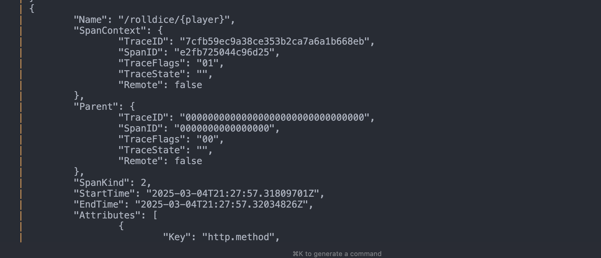

# Instrumenting a Go WebService with Open Telemetry

This repo demos how to instrument a Go web service using the OpenTelemetry SDK for Go. It is based on the [sample dice application](https://opentelemetry.io/docs/languages/go/getting-started/) on the OpenTelemetry getting started documentation.

As an addition, I have packaged the service to run as a container, with the orchestration of the container for the service and a Prometheus instance to (hopefully) collect data from Otel (not sure how exactly this bit should fit together).

## How To

1. Ensure you have Docker installed on your machine

2. Run `$docker compose up -d` to spin up the container and prometheus instance

3. Go to `localhost:8080/rolldice/{yourName}` and refresh the page a few times to generate some telemetry and logs

4. To view the trace and log data from OTel, run `docker compose logs -f` to view and follow the logs

