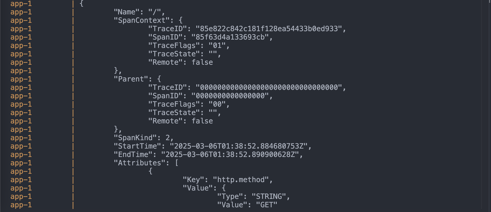

# Instrumenting a Go WebService with Open Telemetry

This repo demos how to instrument a Go web service using the OpenTelemetry SDK for Go. The Service listens for requests on port `8080` and when a `GET` request is received at `/getTemp`, it calls the openweathermap API to fetch the temperature for a given location, as defined in the YAML configuration file (`config.yml`).

The http handler is instrumented with OTel, which enriches the handler's HTTP instrumentation. Custom instrumentation is also provided to the function that makes downstream requests to openweathermap using the `github.com/briandowns/openweathermap` library.

The service is packaged to run as a container, with the orchestration of the container and a Prometheus server via `docker compose`.  

## Example Usage

1. Ensure you have Docker installed on your machine

2. Provision [Openweathermap API keys](https://openweathermap.org/api) and set it as an environment variable `export OWM_API_KEY = "{Your OWM API Key here}"

3. Run `$docker compose up -d --build` to spin up the container and prometheus instance

4. Go to `localhost:8080/getTemp` and refresh the page a few times to generate some telemetry and logs

5. To view the trace and log data from OTel, run `docker compose logs -f` to view and follow the logs

## API Endpoints

- `GET /getTemp` - Returns the current temperature for the configured location
- `GET /metrics` - Prometheus metrics endpoint

## Observability

The service is instrumented with OpenTelemetry and exposes:

- Traces for temperature fetch operations
- Metrics including temperature distribution histogram
- HTTP response codes for API calls
